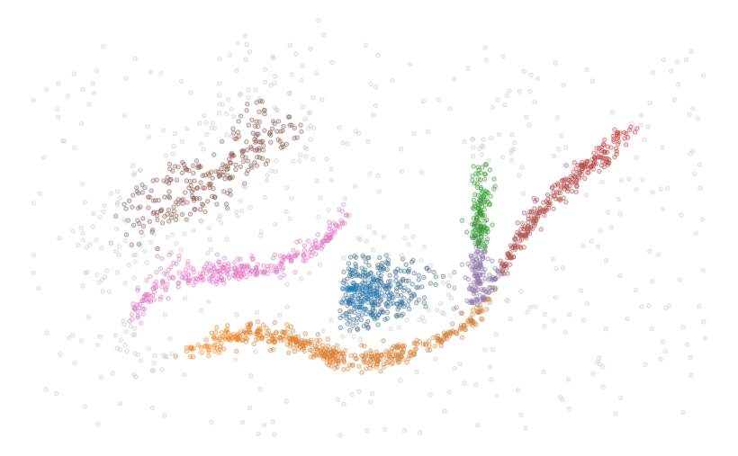

# FLASC: Flare-Sensitive Clustering

FLASC - Flare-Sensitive Clustering, adds an efficient post-processing step to the
[HDBSCAN\*](https://github.com/scikit-learn-contrib/hdbscan)
density-based clustering algorithm to detect branching structures within 
clusters.

The algorithm adds two parameters that may need tuning with respect to HDBSCAN\*,
but both are intuitive to tune: minimum branch size and branch selection strategy.

## How to use FLASC

The FLASC package is closely based on the HDBSCAN* package and supports
the same API, except sparse inputs, which are not supported yet.

```python
from flasc import FLASC
import numpy as np
import seaborn as sns
import matplotlib.pyplot as plt

data = np.load('./notebooks/data/flared_clusterable_data.npy')
clusterer = FLASC(min_cluster_size=15)
clusterer.fit(data)
colors = sns.color_palette('tab10', 10)
point_colors = [
  sns.desaturate(colors[l], p)
  for l, p in zip(clusterer.labels_, clusterer.probabilities_)
]
plt.scatter(data[:, 0], data[:, 1], 2, point_colors, alpha=0.5)
plt.axis('off')
plt.show()
```



## Example Notebooks

A notebook demonstrating how the algorithm works is available at
[How FLASC Works](https://nbviewer.org/github/vda-lab/pyflasc/blob/master/notebooks/How%20FLASC%20Works.ipynb). The other notebooks demonstrate the 
algorithm on several data sets and contain the analyses presented in our paper.

## Installing

Binary wheels are available on PyPI. Presuming you have an up-to-date
pip:

```bash
pip install pyflasc
```
For a manual install of the latest code directly from GitHub:

```bash
pip install --upgrade git+https://github.com/vda-lab/pyflasc.git#egg=pyflasc
```

Alternatively download the package, install requirements, and manually run the installer:

```bash
wget https://github.com/vda-lab/pyflasc/archive/main.zip
unzip main.zip
rm main.zip
cd flasc-main

pip install -t .
```

## Citing

A scientific publication of this algorithm and codebase is in progress. Please
refer back to this section to see how you can cite this work in the future. 

This FLASC algorithm and software package is very closely related to McInnes et al.'s HDBSCAN\* software package. If you wish to cite the HDBSCAN\* package in a
scientific publication, please use their
[Journal of Open Source Software article](http://joss.theoj.org/papers/10.21105/joss.00205).

    L. McInnes, J. Healy, S. Astels, *hdbscan: Hierarchical density based clustering*
    In: Journal of Open Source Software, The Open Journal, volume 2, number 11.
    2017

```bibtex
@article{mcinnes2017hdbscan,
  title={hdbscan: Hierarchical density based clustering},
  author={McInnes, Leland and Healy, John and Astels, Steve},
  journal={The Journal of Open Source Software},
  volume={2},
  number={11},
  pages={205},
  year={2017}
}
```

To reference their high performance algorithm please cite their paper
in ICDMW 2017 proceedings.

    McInnes L, Healy J. *Accelerated Hierarchical Density Based Clustering*
    In: 2017 IEEE International Conference on Data Mining Workshops (ICDMW), IEEE, pp 33-42.
    2017

```bibtex
@inproceedings{mcinnes2017accelerated,
  title={Accelerated Hierarchical Density Based Clustering},
  author={McInnes, Leland and Healy, John},
  booktitle={Data Mining Workshops (ICDMW), 2017 IEEE International Conference on},
  pages={33--42},
  year={2017},
  organization={IEEE}
}
```

## Licensing

The FLASC package has a 3-Clause BSD license.
