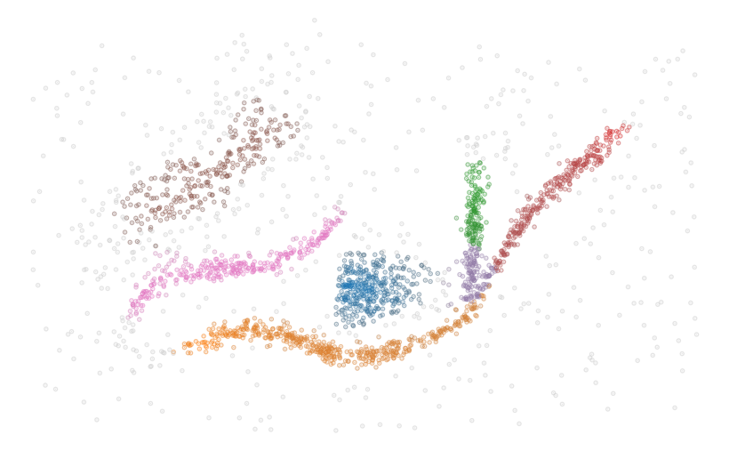

.. toctree::
   :maxdepth: 2
   :hidden:

   examples
   reference

FLASC 
=====

Flare-Sensitive Clustering (FLASC) adds an efficient post-processing step to 
the `HDBSCAN* <https://github.com/scikit-learn-contrib/hdbscan>`_
clustering algorithm to detect branching structures within clusters.

The :py:mod:`flasc` package is closely based on the :py:mod:`hdbscan` package
and supports the same API, except sparse inputs, which are not supported yet.

.. code:: python

   from flasc import FLASC
   import numpy as np
   import seaborn as sns
   import matplotlib.pyplot as plt

   data = np.load('./notebooks/data/flared/flared_clusterable_data.npy')
   clusterer = FLASC(min_cluster_size=15)
   clusterer.fit(data)
   colors = sns.color_palette('tab10', 23)
   point_colors = [ 
      sns.desaturate(colors[l], p) 
      for l, p in zip(clusterer.labels_, clusterer.probabilities_)
   ]
   plt.scatter(data[:, 0], data[:, 1], 2, point_colors, alpha=0.5)
   plt.axis('off')
   plt.show()

Citing
------

Please cite `our publication <https://doi.org/10.7717/peerj-cs.2792>`_ when using the algorithm:

::

    Bot DM, Peeters J, Liesenborgs J, Aerts J. 2025. FLASC: a flare-sensitive
    clustering algorithm. PeerJ Computer Science 11:e2792
    https://doi.org/10.7717/peerj-cs.2792 

in bibtex:

.. code:: bibtex

   @article{bot2025flasc,
      title   = {{FLASC: a flare-sensitive clustering algorithm}},
      author  = {Bot, Dani{\"{e}}l M. and Peeters, Jannes and Liesenborgs, Jori and Aerts, Jan},
      year    = {2025},
      month   = {apr},
      journal = {PeerJ Comput. Sci.},
      volume  = {11},
      pages   = {e2792},
      issn    = {2376-5992},
      doi     = {10.7717/peerj-cs.2792},
      url     = {https://peerj.com/articles/cs-2792},
   }

The FLASC algorithm and software package is closely related to McInnes et al.'s
HDBSCAN\* software package. We refer to their `Journal of Open Source Software
article <http://joss.theoj.org/papers/10.21105/joss.00205>`_ and `paper in the
ICDMW 2017 proceedings
<https://ieeexplore.ieee.org/abstract/document/8215642/>`_ for information on
how to cite their software package and high-performance algorithm.